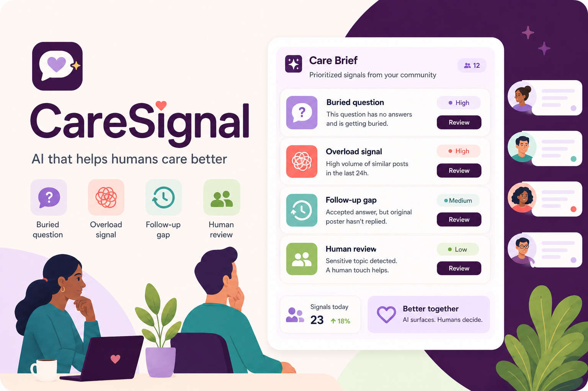
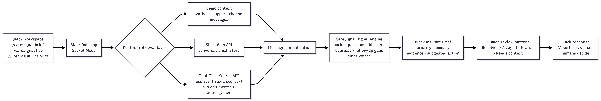
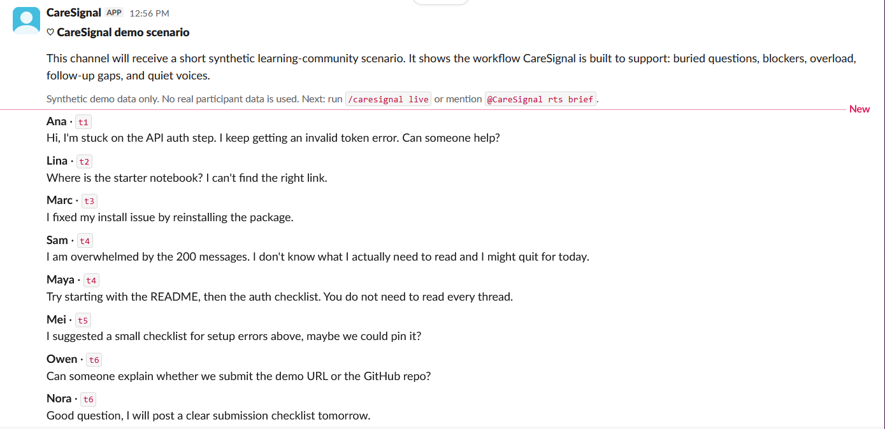
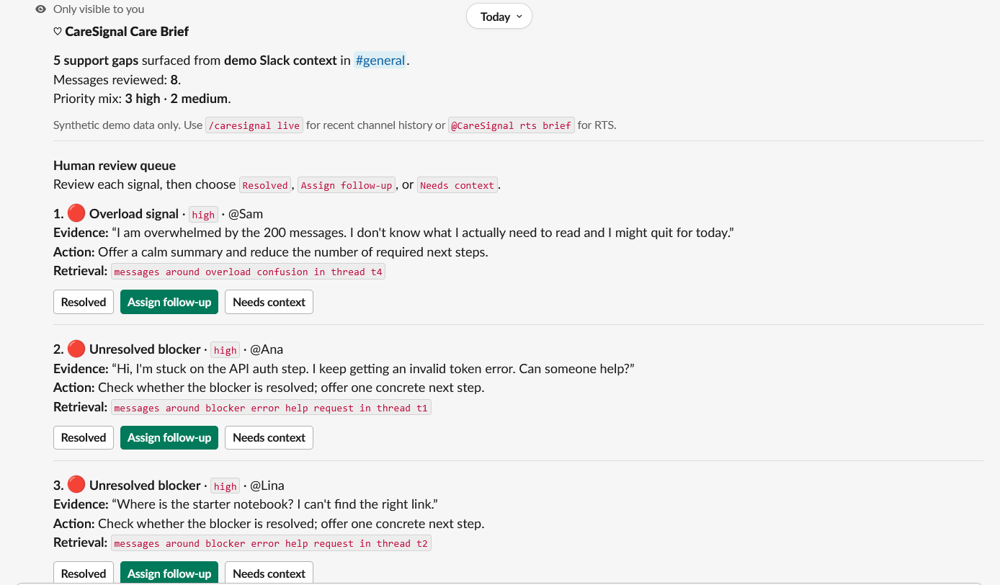
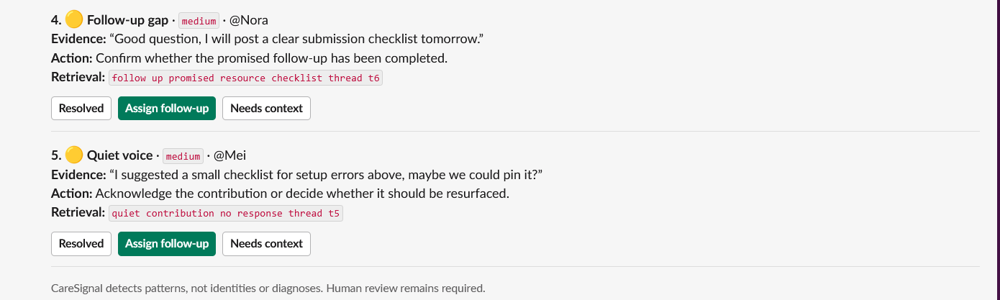
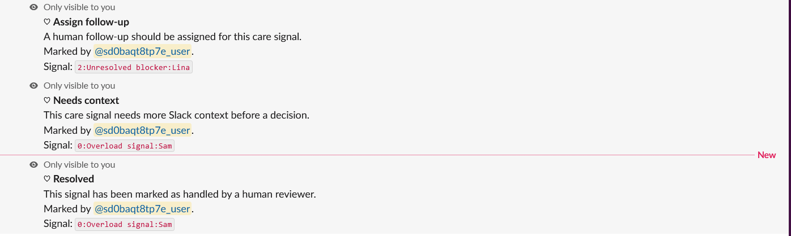
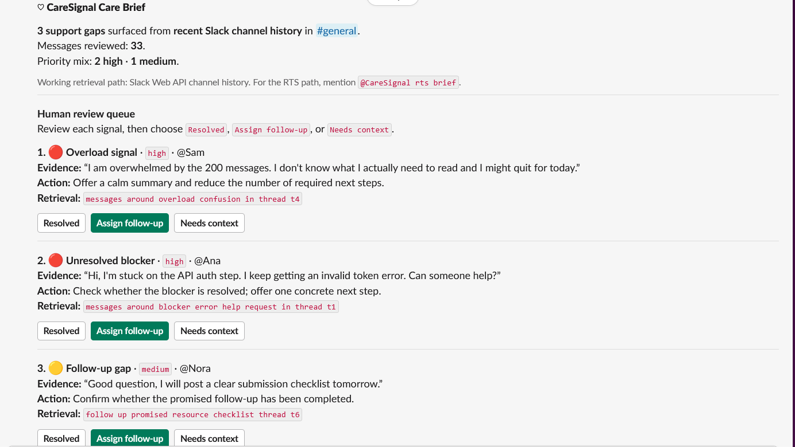
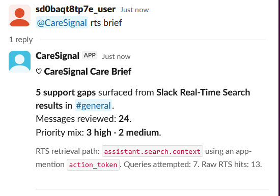
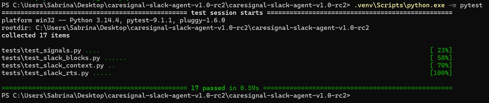

# ♡ CareSignal

<p align="center">
  
</p>

<p align="center">
  
  
  
  
  
  
  
</p>

**CareSignal is a Slack-based AI agent prototype that turns busy community conversations into human-reviewable Care Briefs.**

It helps moderators, mentors, community leads, and support teams notice buried questions, unresolved blockers, overload signals, follow-up gaps, and overlooked contributions — without diagnosing, classifying, or labeling participants.

> **CareSignal: AI that helps humans care better.**

---

## Demo video

🎬 **Demo video:** `TODO: add YouTube demo link here`

The demo shows CareSignal running inside a Slack developer sandbox, including:

* synthetic demo scenario generation;
* Care Brief generation;
* human-review actions;
* live Slack channel history retrieval;
* Real-Time Search context retrieval via `assistant.search.context`.

---

## Why CareSignal exists

Busy Slack communities can be generous and lively, but they can also move too fast.

In a noisy support channel, the loudest or fastest participants often get the most attention. Meanwhile, someone may be stuck, overwhelmed, unable to find a resource, or quietly contributing something useful that nobody notices.

CareSignal is designed for that gap.

It does not try to replace moderators. It organizes attention so humans can make better, kinder follow-up decisions.

---

## Built for the Slack Agent Builder Challenge

CareSignal is built for the **Slack Agent for Good** track.

It addresses a real-world social impact problem: helping learning, support, nonprofit, open-source, and community spaces become more attentive to people who may otherwise fall through the cracks.

The project uses Slack agentic capabilities and the required Slack technology path through:

* Slack interactions and slash commands;
* Slack Bolt for Python;
* Slack Socket Mode;
* Slack Block Kit;
* Slack Web API channel history;
* Slack Real-Time Search API path via `assistant.search.context`.

---

## What it does

CareSignal turns Slack context into a concise, human-reviewable **Care Brief**.

It surfaces support signals such as:

| Signal                 | Meaning                                                                         |
| ---------------------- | ------------------------------------------------------------------------------- |
| **Buried question**    | A question may have been missed in a busy channel.                              |
| **Unresolved blocker** | Someone may be stuck and unable to continue.                                    |
| **Overload signal**    | A participant may be overwhelmed by volume or complexity.                       |
| **Follow-up gap**      | Someone promised help, a checklist, or a resource, but closure is still needed. |
| **Quiet voice**        | A useful contribution or low-volume participant may deserve attention.          |

Each signal is presented with:

* priority level;
* short evidence from the conversation;
* suggested next kind action;
* human-review buttons.

CareSignal keeps the final decision with humans.

---

## Human review actions

CareSignal’s Block Kit brief includes review buttons such as:

* **Resolved**
* **Assign follow-up**
* **Needs context**

These actions reinforce the core design principle:

> AI surfaces signals. Humans decide.

---

## Slack commands

| Command                 | Purpose                                                            |
| ----------------------- | ------------------------------------------------------------------ |
| `/caresignal help`      | Shows available CareSignal commands.                               |
| `/caresignal demo`      | Posts a synthetic noisy support-channel scenario.                  |
| `/caresignal brief`     | Generates a Care Brief from packaged demo context.                 |
| `/caresignal live`      | Analyzes recent messages from the current Slack channel.           |
| `/caresignal rts`       | Explains the Real-Time Search workflow.                            |
| `@CareSignal rts brief` | Uses the Real-Time Search path through `assistant.search.context`. |

---

## Retrieval modes

CareSignal supports three context paths.

### 1. Demo context

A stable synthetic dataset used for demonstration, testing, and safe review.

This avoids exposing real personal or community data while still showing a realistic support-channel scenario.

### 2. Live channel history

CareSignal can analyze recent messages from the current Slack channel using Slack Web API channel history.

This demonstrates that the agent is not limited to static demo data.

### 3. Real-Time Search path

CareSignal can use Slack’s Real-Time Search path through:

```text
assistant.search.context
```

The app mention flow uses an action token to retrieve relevant Slack context, then normalizes the retrieved messages and passes them through the same support-signal engine.

This makes Real-Time Search part of the actual care-brief workflow, not a decorative add-on.

---

## Architecture

<p align="center">
  
</p>

At a high level:

```text
Slack workspace
→ Slack Bolt app in Socket Mode
→ context retrieval layer
→ message normalization
→ CareSignal support-signal engine
→ Block Kit Care Brief
→ human review actions
→ Slack response
```

The context retrieval layer can use:

* synthetic demo context;
* Slack Web API channel history;
* Slack Real-Time Search via `assistant.search.context`.

---

## Screenshots

### Demo scenario

<p align="center">
  
</p>

### Care Brief

<p align="center">
  
</p>

<p align="center">
  
</p>

### Human review action

<p align="center">
  
</p>

### Live channel history

<p align="center">
  
</p>

### Real-Time Search brief

<p align="center">
  
</p>

### Tests

<p align="center">
  
</p>

---

## Tech stack

* **Python**
* **Slack Bolt for Python**
* **Slack Socket Mode**
* **Slack Block Kit**
* **Slack Web API**
* **Slack Real-Time Search API path**
* **Pytest**

---

## Local setup

Create and install dependencies:

```powershell
python -m venv .venv
.venv\Scripts\python.exe -m pip install -r requirements.txt
Copy-Item .env.example .env
```

Fill `.env` with your own Slack app credentials:

```env
SLACK_BOT_TOKEN=xoxb-...
SLACK_SIGNING_SECRET=...
SLACK_APP_TOKEN=xapp-...
```

Run tests:

```powershell
.venv\Scripts\python.exe -m pytest
```

Run the Slack app locally:

```powershell
.venv\Scripts\python.exe -m src.slack_app.server
```

The app uses **Socket Mode**, so it does not require `ngrok` for local development.

---

## Required Slack app configuration

Bot token scopes:

```text
commands
chat:write
channels:read
channels:history
app_mentions:read
search:read.public
```

Socket Mode app-level token scope:

```text
connections:write
```

Event subscription:

```text
app_mention
```

After adding scopes or event subscriptions, reinstall the app to the Slack developer sandbox.

In any channel where you want to test CareSignal, add the app first:

```text
/invite @CareSignal
```

---

## Suggested demo flow

In a Slack channel where CareSignal has been added:

```text
/caresignal demo
/caresignal brief
```

Then click:

```text
Assign follow-up
Needs context
```

To demonstrate live channel context:

```text
/caresignal live
```

To demonstrate the Real-Time Search path:

```text
@CareSignal rts brief
```

---

## Testing

Run:

```powershell
.venv\Scripts\python.exe -m pytest
```

The test suite covers the core signal-detection behavior and Slack-facing formatting logic.

---

## Ethics and safety stance

CareSignal is **not** “AI that cares.”

It is AI that helps humans care better.

CareSignal does not infer disability, anxiety, vulnerability, personality, motivation, or identity. It does not diagnose, classify, or label participants.

Instead, it surfaces possible support patterns from the conversation and asks humans to review them.

Core principles:

* detect patterns, not identities;
* preserve human judgment;
* avoid sensitive trait inference;
* use synthetic demo data for safe demonstration;
* make support needs more legible without turning people into labels.

---

## Project structure

```text
caresignal-slack-agent/
├── assets/
│   ├── caresignal_thumbnail.png
│   ├── caresignal_architecture.png
│   └── screenshots/
│       ├── 01-demo-scenario.png
│       ├── 02-care-brief-1.png
│       ├── 02-care-brief-2.png
│       ├── 03-human-review-action.png
│       ├── 04-live-channel-history.png
│       ├── 05-rts-brief.png
│       └── 06-tests-passing.png
├── docs/
│   ├── architecture.md
│   ├── architecture_diagram.mmd
│   ├── architecture_diagram.svg
│   ├── demo_script.md
│   ├── devpost_submission.md
│   ├── ethics_and_safety.md
│   ├── judge_testing.md
│   └── submission_checklist.md
├── src/
│   └── slack_app/
├── tests/
├── .env.example
├── requirements.txt
└── README.md
```

---

## Submission materials

Useful supporting files:

* `docs/architecture.md`
* `docs/architecture_diagram.mmd`
* `docs/architecture_diagram.svg`
* `assets/caresignal_architecture.png`
* `docs/demo_script.md`
* `docs/devpost_submission.md`
* `docs/judge_testing.md`
* `docs/ethics_and_safety.md`
* `docs/submission_checklist.md`

---

## License

MIT
